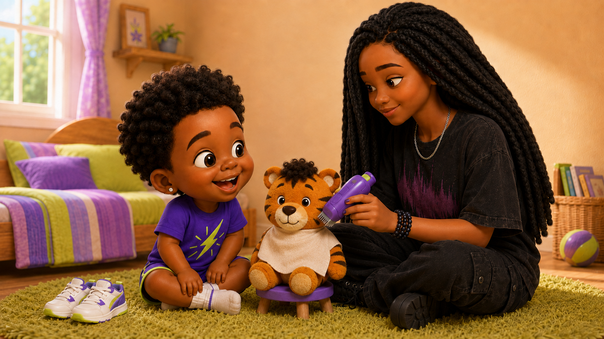
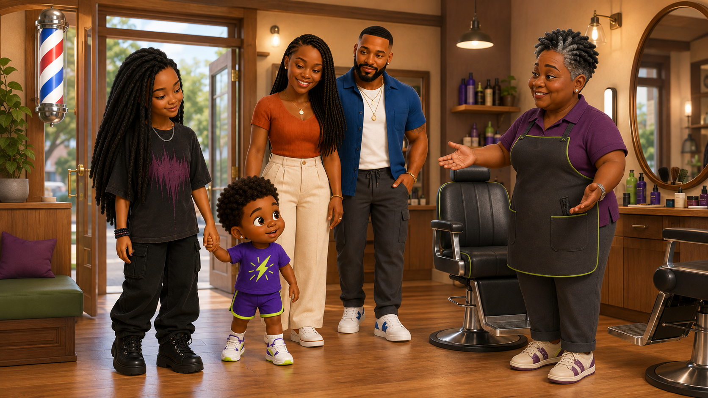
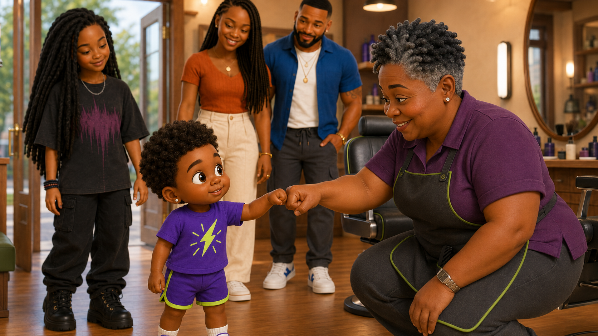
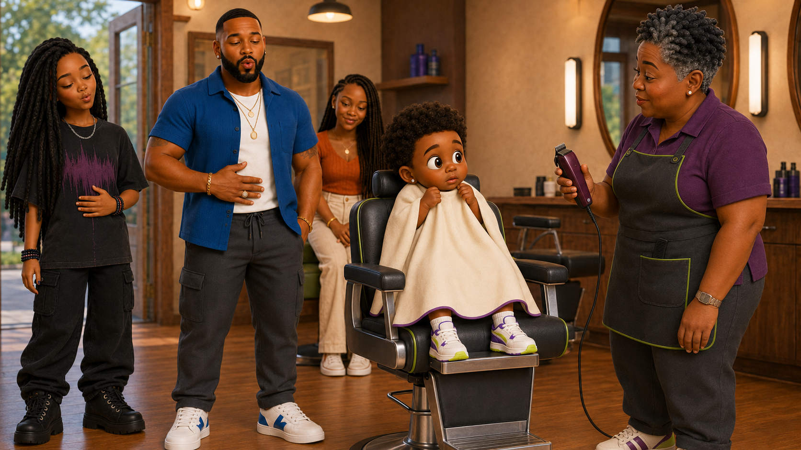
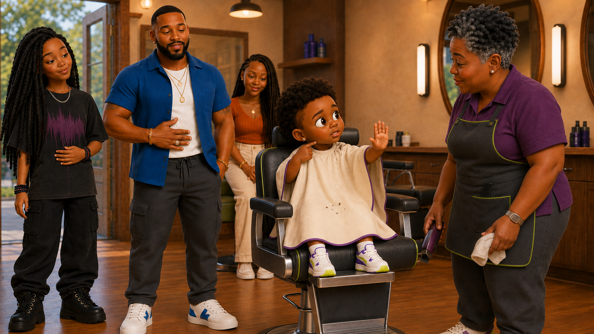
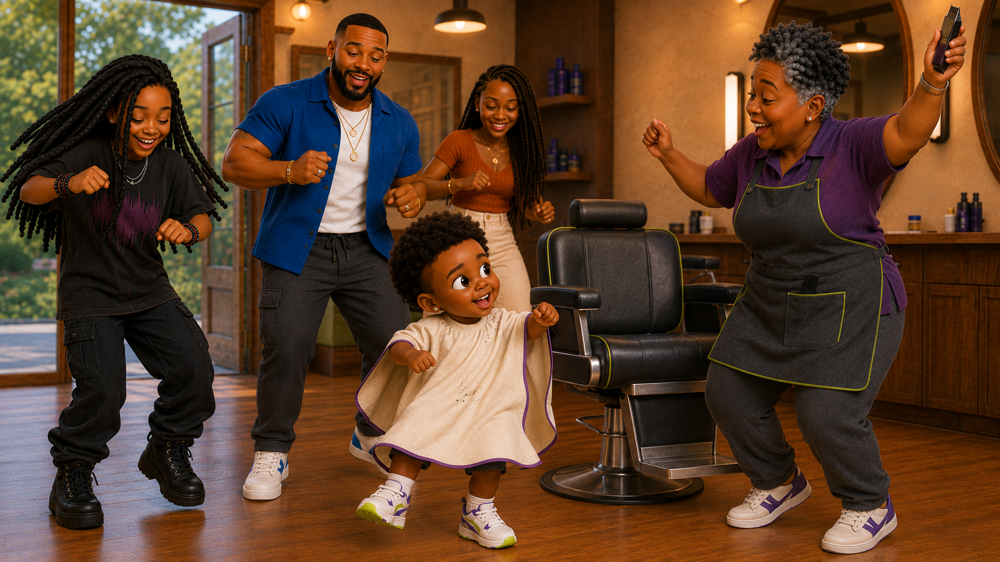
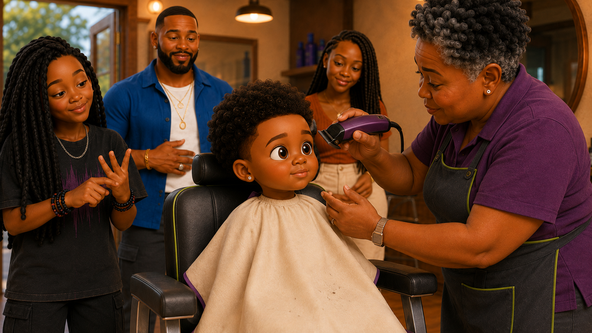
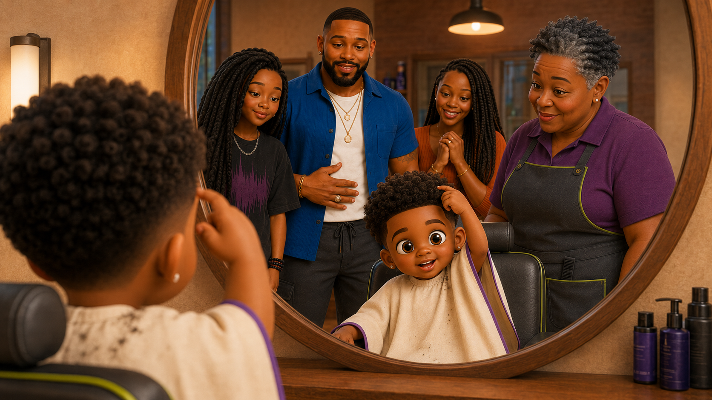
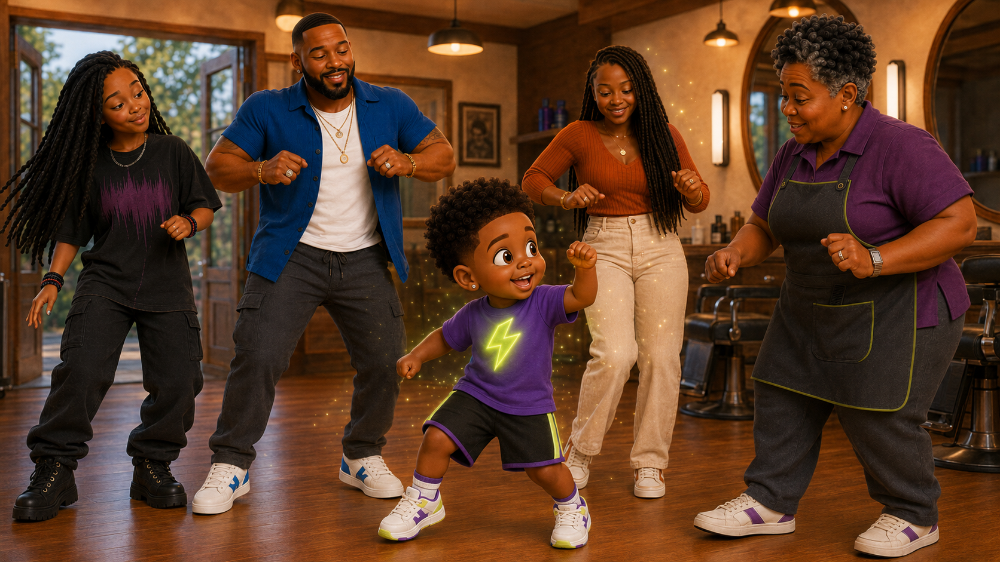

# Episode 001 Storyboard — Limi’s First Haircut

## Series Information

**Series:** *Adventures with Limi*  
**Episode:** 001  
**Storyboard Panels:** 13

## Visual Direction

- Warm, colorful 3D preschool-animation style
- Real-world locations with gentle imaginative effects
- Limi’s facial expressions clearly communicate his emotions
- Purple and electric-lime accents connect the visual world
- Camera remains near Limi’s height so toddlers experience the story with him
- Tiggy remains a recognizable stuffed tiger and comfort companion
- Character designs, complexions, hairstyles, clothing, jewelry, and wedding rings follow the approved visual references

## Storyboard Panels

### Panel 1 — Choosing Sneakers

**Shot:** Wide view of Limi’s bedroom  
**Visual:** Limi dances in front of the mirror while comparing two pairs of sneakers.  
**Emotion:** Happy and relaxed

### Panel 2 — Haircut Announcement

**Shot:** Medium view of Limi and Maya  
**Visual:** Maya mentions the barbershop. Limi freezes while clutching both sneakers.  
**Emotion:** Nervous while pretending to be confident

### Panel 3 — Jazz Notices

**Shot:** Close-up of Limi and Jazz  
**Visual:** Jazz kneels beside Limi and points out his wide eyes, tight shoulders, and grip on the shoes.  
**Emotion:** Caring and observant

### Panel 4 — Practicing With Tiggy

**Shot:** Wide view on the bedroom floor  
**Visual:** Jazz demonstrates the haircut steps using Tiggy and pretend clippers.  
**Learning Beat:** First, next, then, last

### Panel 5 — Team Limi at Breakfast

**Shot:** Medium-wide family view  
**Visual:** Limi Sr. reassures Limi during breakfast. Maya, Jazz, Limi Sr., and Limi stack their hands together while Tiggy sits safely nearby.  
**Emotion:** Supported, reassured, and ready  
**Dialogue:** “Team Limi!”

### Panel 6 — Arriving at the Barbershop

**Shot:** Wide exterior-to-entrance view  
**Visual:** Limi approaches the welcoming barbershop holding Tiggy and Limi Sr.’s hand. His family waits patiently while he looks inside.  
**Emotion:** Cautious but curious

### Panel 7 — Meeting Ms. Toni

**Shot:** Medium view  
**Visual:** Ms. Toni lowers herself to Limi’s height and offers him a fist bump while Jazz stands nearby.  
**Learning Beat:** Children can choose how they greet someone

### Panel 8 — Hearing the Clippers

**Shot:** Close-up  
**Visual:** Ms. Toni turns on the clippers from a safe distance. Limi raises his shoulders as Jazz models a slow breath.  
**Learning Beat:** Smell the flower, blow out the candle

### Panel 9 — “Break, Please”

**Shot:** Medium view of the barber chair  
**Visual:** Loose hair makes Limi’s neck itchy. He raises his hand and asks for a break. Ms. Toni immediately stops.  
**Learning Beat:** Use words to communicate what your body needs

### Panel 10 — Wiggle Break

**Shot:** Full-body view beside the chair  
**Visual:** Limi, Jazz, and the audience wiggle, stomp three times, reach high, and breathe.  
**Emotion:** Playful relief

### Panel 11 — Still-as-a-Statue Game

**Shot:** Medium close-up  
**Visual:** Limi sits tall while everyone counts slowly from one to five.  
**Learning Beat:** Counting and body control

### Panel 12 — Mirror Reveal

**Shot:** Over-the-shoulder view toward the mirror  
**Visual:** Limi sees his full curls and fresh shape-up for the first time.  
**Emotion:** Proud and delighted

### Panel 13 — Light It Up

**Shot:** Final wide view  
**Visual:** Limi, Jazz, Maya, Limi Sr., and Ms. Toni celebrate as Limi’s shirt symbol gives off a gentle electric-lime glow.  
**Dialogue:** “We learned something new—and now we shine!”  
**Music Cue:** Instrumental reprise of the “Adventures with Limi” theme

