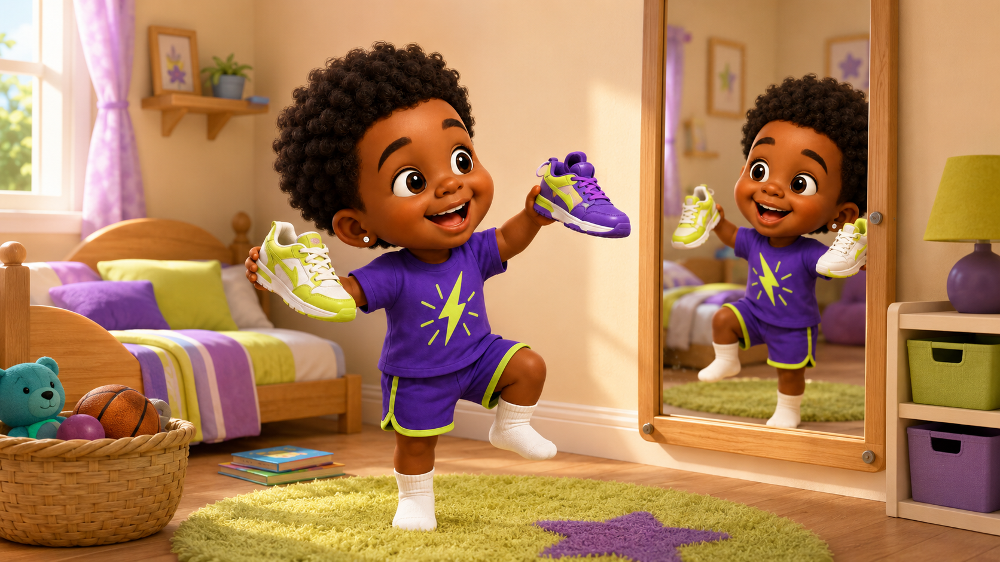
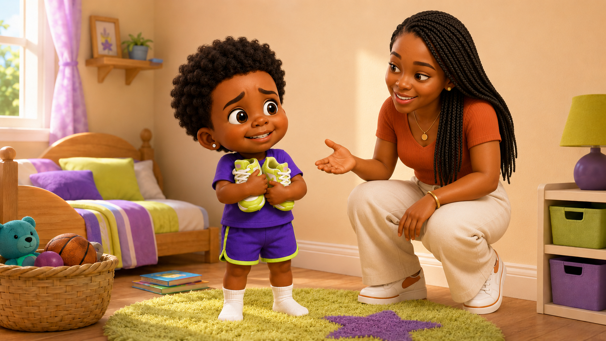
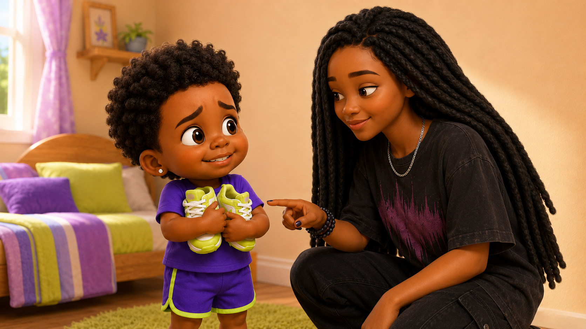
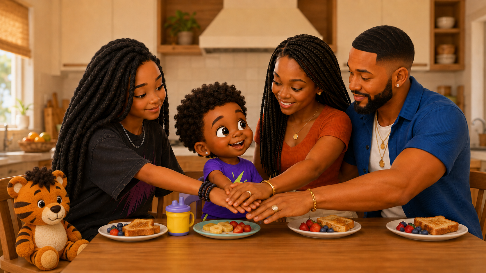

# Episode 001 Storyboard — Limi’s First Haircut

## Visual Direction

- Warm, colorful 3D preschool-animation style
- Real-world locations with gentle imaginative effects
- Limi’s facial expressions clearly communicate his emotions
- Each character maintains an individual signature color palette
- Limi’s purple and electric-lime colors remain the show’s primary visual anchor
- Camera remains near Limi’s height so toddlers experience the story with him
- Family members remain actively involved without overwhelming Limi’s story

## Storyboard Panels

### Panel 1 — Choosing Sneakers

**Shot:** Wide view of Limi’s bedroom  
**Visual:** Limi dances in front of the mirror while comparing two pairs of sneakers.  
**Emotion:** Happy and relaxed  

### Panel 2 — Haircut Announcement

**Shot:** Medium view of Limi and Maya  
**Visual:** Maya mentions the barbershop. Limi freezes while clutching both sneakers tightly against his chest.  
**Emotion:** Nervous, but pretending to be confident  

### Panel 3 — Jazz Notices

**Shot:** Close view of Limi and Jazz  
**Visual:** Jazz kneels beside Limi and points out his wide eyes, tight shoulders, and firm grip on the sneakers.  
**Emotion:** Caring, observant, and emotionally safe  

### Panel 4 — Practicing with Mr. Curls

**Shot:** Wide view at floor level  
**Visual:** Jazz demonstrates the haircut steps using Mr. Curls, Limi’s original stuffed tiger with a curly tuft, and harmless pretend clippers.  
**Emotion:** Curious and increasingly comfortable  
**Learning Beat:** First, next, then, last  

### Panel 5 — Team Limi at Breakfast

**Shot:** Medium-wide family view  
**Visual:** Limi Sr. reassures Limi during breakfast. Maya, Jazz, Limi Sr., and Limi stack their hands together while Mr. Curls sits nearby.  
**Emotion:** Supported, reassured, and ready  
**Dialogue:** “Team Limi!”  

### Panel 6 — Arriving at the Barbershop

**Shot:** Wide view from near Limi’s height  
**Visual:** Maya, Limi Sr., Jazz, and Limi enter the warm neighborhood barbershop together. Limi notices the mirrors, chairs, barber pole, combs, customers, and clippers.  
**Emotion:** Curious but uncertain  
**Learning Beat:** Preparing for a new environment  

### Panel 7 — Meeting Ms. Toni

**Shot:** Medium view  
**Visual:** Ms. Toni kneels slightly and offers Limi a choice between a high five, fist bump, or wave. Limi chooses a fist bump while his family remains nearby.  
**Emotion:** Cautious but beginning to trust  
**Learning Beat:** Children can choose how they greet someone  

### Panel 8 — Hearing the Clippers

**Shot:** Close view of Limi in the barber chair  
**Visual:** Ms. Toni turns on the clippers from a safe distance. Limi raises his shoulders while Limi Sr. and Jazz model a slow calming breath.  
**Emotion:** Nervous but supported  
**Learning Beat:** Smell the flower, blow out the candle  

### Panel 9 — “Break, Please”

**Shot:** Medium view of the barber chair  
**Visual:** Loose hair makes Limi’s neck feel itchy. He raises his hand and asks for a break. Ms. Toni immediately turns off the clippers and brushes away the loose hair.  
**Emotion:** Uncomfortable, then relieved  
**Learning Beat:** Use words to communicate what your body needs  

### Panel 10 — Wiggle Break

**Shot:** Full-body view beside the barber chair  
**Visual:** Limi takes a safe movement break. He wiggles his arms, stomps three times, reaches high, and breathes while Jazz and the audience join him.  
**Emotion:** Playful relief  
**Learning Beat:** Movement can help the body reset  

### Panel 11 — Still-as-a-Statue Game

**Shot:** Medium close view  
**Visual:** Limi returns to the chair and sits tall while everyone counts slowly from one to five. Ms. Toni completes the final section of his haircut.  
**Emotion:** Focused and determined  
**Learning Beat:** Counting and body control  

### Panel 12 — Mirror Reveal

**Shot:** Over-the-shoulder view toward the mirror  
**Visual:** Limi sees his full 4B curls and fresh shape-up for the first time. Maya, Limi Sr., Jazz, and Ms. Toni watch his reaction.  
**Emotion:** Proud, relieved, and delighted  
**Dialogue:** “That’s me! I look fresh!”  

### Panel 13 — Light It Up

**Shot:** Final wide view  
**Visual:** Limi, Jazz, Maya, Limi Sr., and Ms. Toni dance together as the light symbol on Limi’s shirt gives off a gentle lime glow.  
**Emotion:** Joyful and accomplished  
**Dialogue:** “We learned something new—and now we shine!”